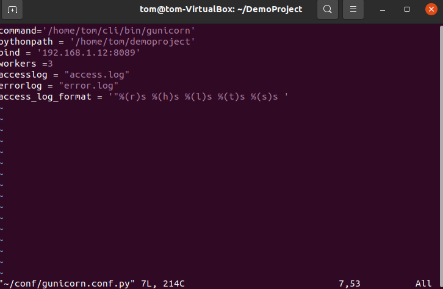

# Gunicorn

> Create Django starter project in a separate virtual environment.

A virtual environment needs to be created

```
python3 -m venv ~/cli
```

To access the virtual environment

```
source ~/cli/bin/activate
```

Now to install Django we will be using pip

```
pip install django
```

Creating a starter Django project

```
django-admin startproject demoproject
```


---

> Deploy the 3 instances of application using Gunicorn in 8089 port

Installing of Gunicorn, app server for Django 

```
pip install gunicorn
```

Now to configure gunicorn server we need to create a configuration file, preferably in a config folder. Config file needs to be a .py file. Let’s create a configuration file gunicorn.conf and write the settings as below:

```
command=’<path-to-guincorn-binary>'
pythonpath=’<path-to-python-project>’
bind=’<ip>:<port>’
workers=3
```

To deploy the application to gunicorn now we need to run the command:

```
gunicorn -c <path-to-config> projectname.[wsgi]
```


---

> Dump access log in a file in non-default pattern.

To dump access log, we can change the Gunicorn config file with **accesslog** setting and we can change the patters as well using **access_log_format** settings.



So, the new config file becomes:

```
command=’<path-to-guincorn-binary>'
pythonpath=’<path-to-python-project>’
bind=’<ip>:<port>’
workers=3
accesslog =”access.log”
access_log_format = ‘”%(r)s %(h)s %(l)s %(t)s %(s)s ‘
```

> Dump error log in a file.

Similar to access log, error logs can be dumped using the config file with errorlog setting.
Config file at the end becomes:

```
command=’<path-to-guincorn-binary>'
pythonpath=’<path-to-python-project>’
bind=’<ip>:<port>’
workers=3
accesslog =”access.log”
access_log_format = ‘”%(r)s %(h)s %(l)s %(t)s %(s)s ‘
errorlog =”error.log”
```

